# AgentPlace — AI-Powered Campus Placement Suite 🚀

> Transforms a student profile into a placement-ready portfolio using Generative AI, microservices, and real-time mock interviews.

**Live Demo:** https://career-architect-zbs9.vercel.app

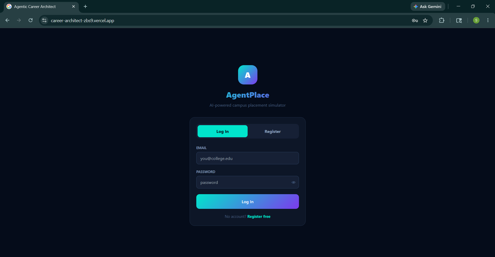

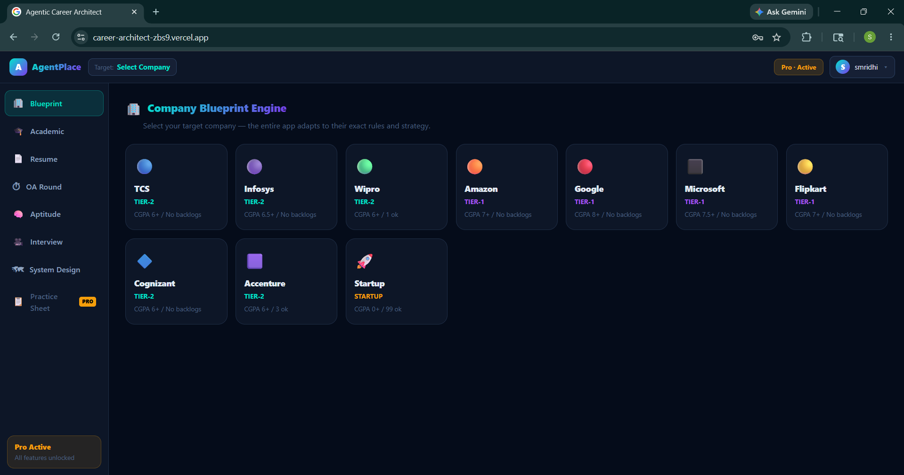


---

## ⚠️ Before Running the Demo

This app uses a free Render instance that sleeps after inactivity.

**Open this URL first and wait 30 seconds:**
👉 https://career-architect-ai-h4ii.onrender.com/health

You should see: `{"status":"ok"}` — then the app is fully live.

> The app also auto-wakes on load, but visiting the health URL first ensures zero wait time during a demo.

**To Demo:**
Register a free account on the live site — the 2-hour trial starts immediately.
To see Pro features, use UTR code `991920` in the payment flow.

---

## 🧠 Features

### 1. 🏢 Company Blueprint Engine
Generates a personalised 30-day roadmap based on target company (TCS, Amazon, Google, etc.). Checks CGPA and backlog eligibility against real company cutoffs. Free tier.
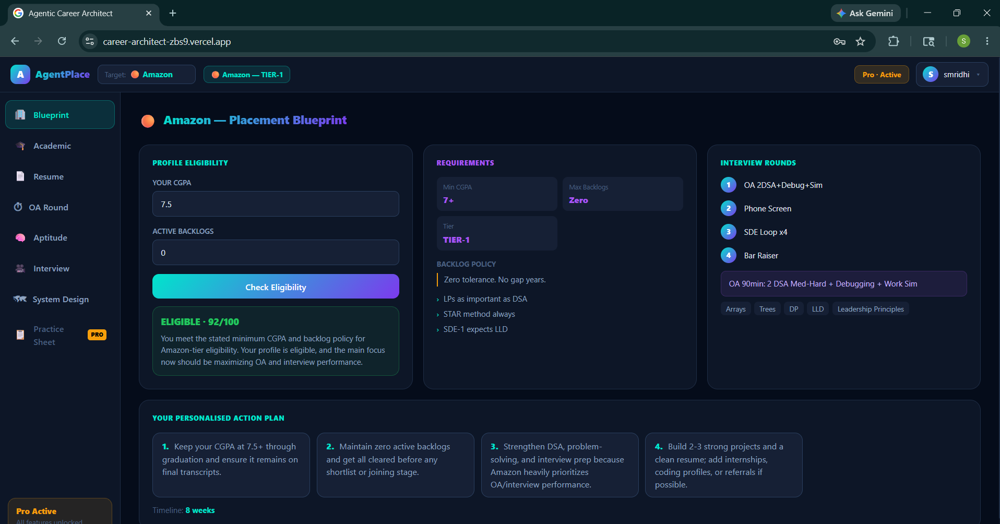


---

### 2. 🎓 Academic Optimizer
Tracks CGPA trajectory and backlog status. Identifies blockers like pending re-exams. Generates a 12-week hybrid study + DSA timeline. Free tier.
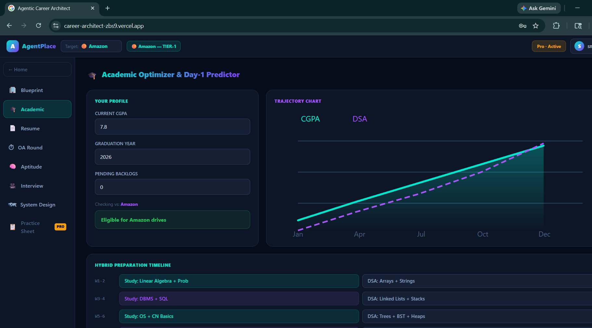


---

### 3. 📄 ATS Resume & GitHub Analyser
Reads actual PDF text and live GitHub profile data via the GitHub API. Returns an ATS score, keyword gap analysis, strengths, weaknesses, and 3 AI-generated interview questions based on real projects. Free tier.
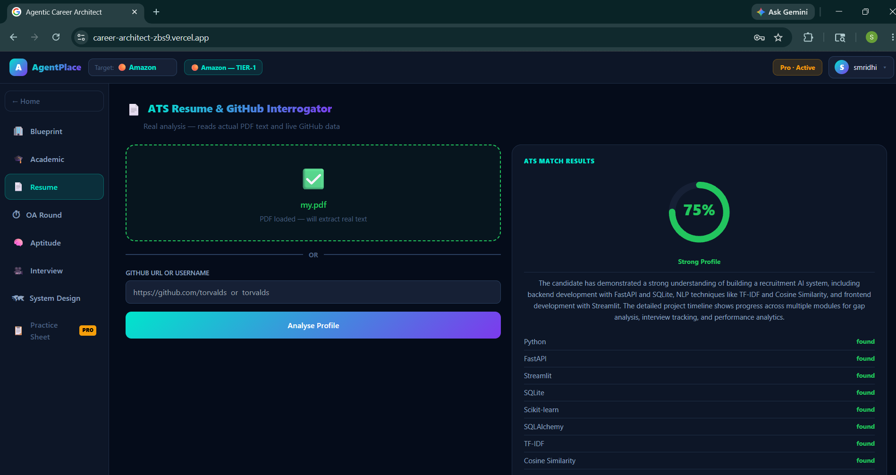


---

### 4. ⏱ OA Round Simulator
Timed coding environment (90-minute countdown) with 8 DSA problems. Supports JavaScript execution, test case running, and AI Big-O complexity analysis. Free tier.
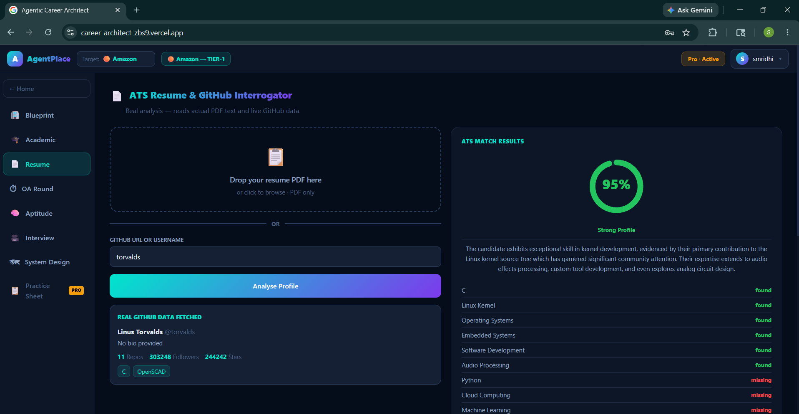


---

### 5. 🧠 Aptitude Training Centre
50-question bank across Quant, Logic, and Verbal. Timed 30-second per question. Tracks score history in localStorage. Free tier.

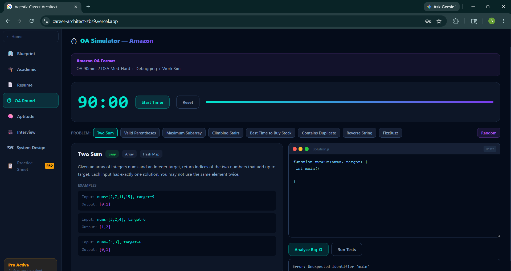

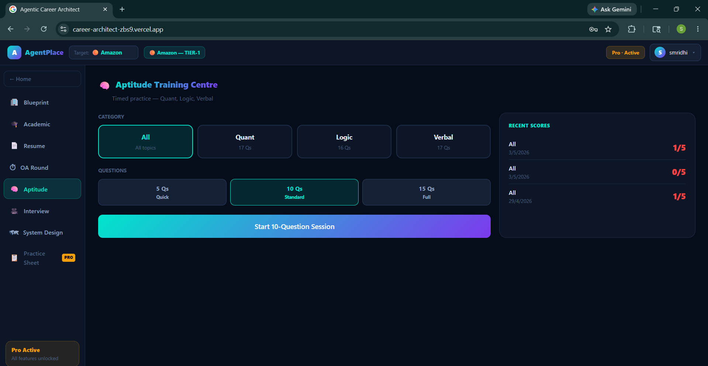


---

### 6. 🎥 Live AI Mock Interview
Real-time video mock interview with 3 interviewer personas (friendly HR, strict FAANG, behavioural HR). Speech-to-text input, text-to-speech AI responses, 6-question dynamic flow, and a full performance report with scores across communication, technical, and confidence. Pro tier.
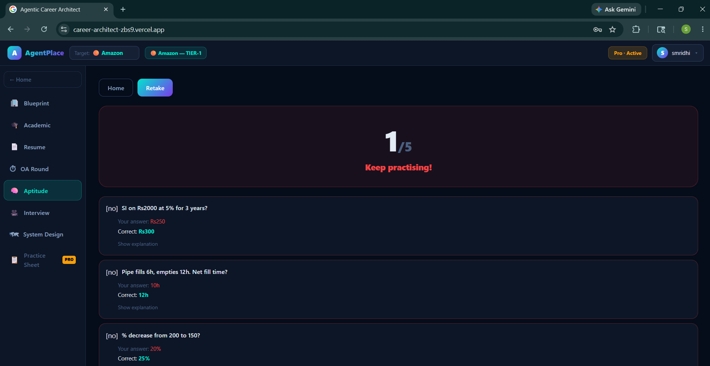

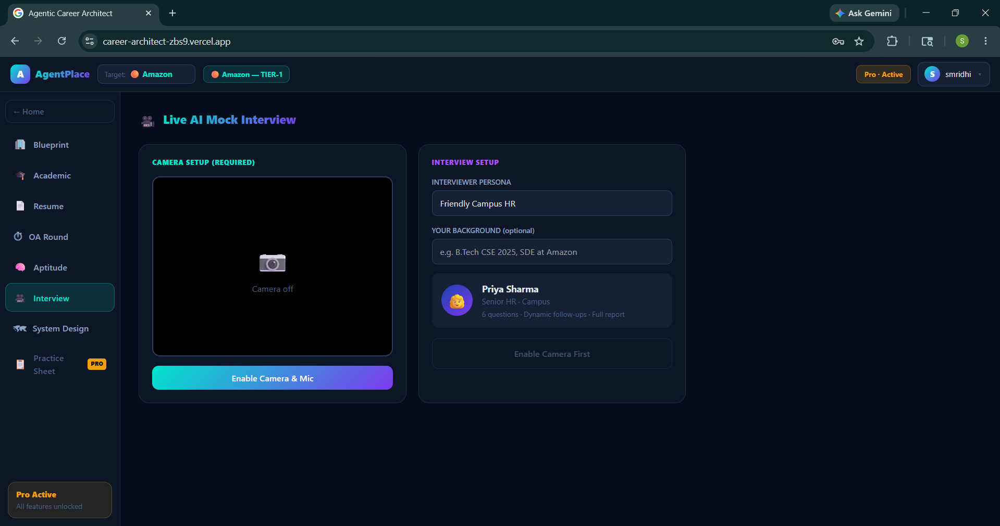


---

### 7. 🗺 System Design Whiteboard
Drag-and-drop architecture builder with 10 components (Client, Load Balancer, Cache, Database, etc.). Click two nodes to connect them. Click a connection line to remove it. AI critique gives score, strengths, issues, and suggestions. Pro tier.
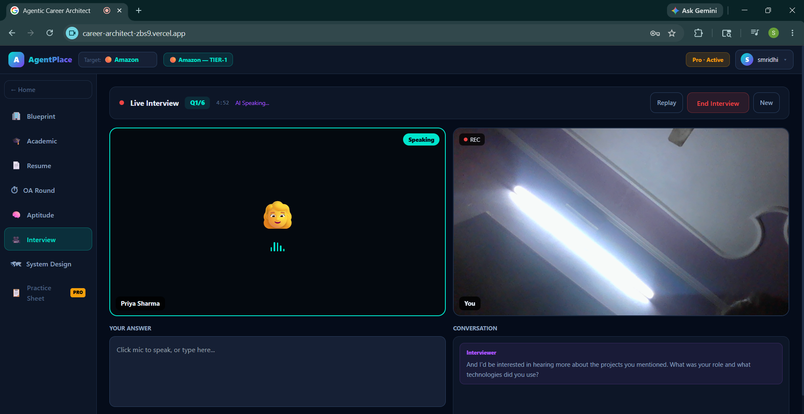

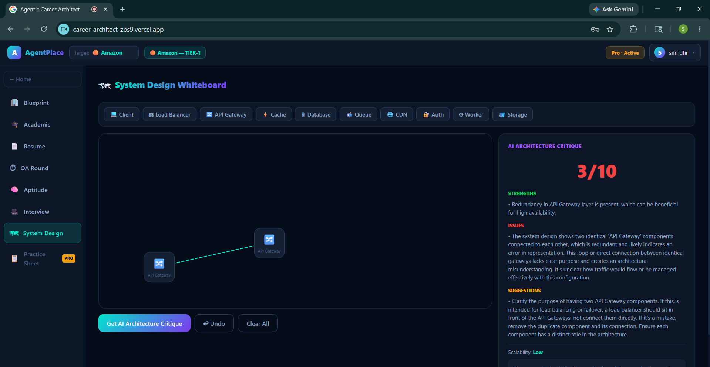

---

### 8. 📋 Practice Sheets
DSA cheat sheet, interview patterns (STAR, coding flow, system design framework), aptitude formulae, and HR guide. Pro tier.
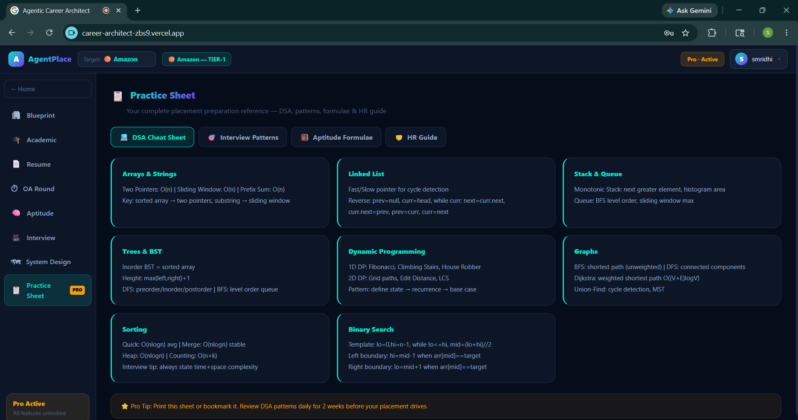

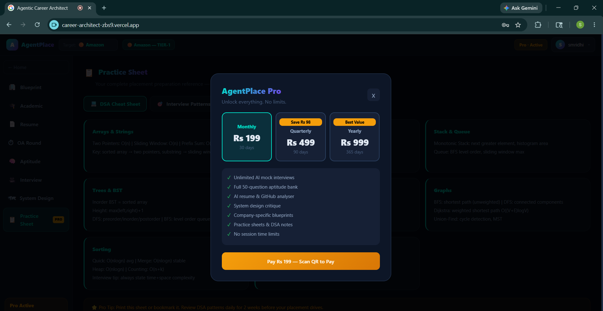

---

## 💳 Subscription System

### Free Trial (2 Hours)
- 7200-second countdown timer shown in navbar
- Access to Blueprint, Academic, Resume, OA, Aptitude tabs
- Timer stored per account using account creation timestamp

### Pro Tier Upgrade Flow!


- Select plan (Monthly ₹199 / Quarterly ₹499 / Yearly ₹999)
- Scan QR code → enter UTR number `991920` → verified instantly
- Unlocks Interview Simulator, System Design, Practice Sheets
- Pro status persisted in PostgreSQL database (survives logout/login)

---

## 🏗️ Architecture

```
┌─────────────────┐     ┌──────────────────┐     ┌─────────────────┐
│   Next.js 15    │────▶│  Spring Boot 3.2 │────▶│  PostgreSQL 16  │
│   (Vercel)      │     │  (Docker)        │     │  (Docker)       │
└────────┬────────┘     └──────────────────┘     └─────────────────┘
         │
         ▼
┌─────────────────┐
│   FastAPI       │────▶  OpenRouter AI (nvidia/mistral free tier)
│   (Render)      │────▶  GitHub REST API
│                 │────▶  pypdf (resume parsing)
└─────────────────┘
```

### Tech Stack

| Layer | Technology | Purpose |
|-------|-----------|---------|
| Frontend | Next.js 15, React 19 | UI, session management, timer logic |
| Backend | Spring Boot 3.2, JPA | Auth, user data, Pro status |
| AI Engine | FastAPI, OpenRouter | LLM calls, GitHub fetch, PDF parse |
| Database | PostgreSQL 16 | User accounts, Pro expiry |
| Monitoring | Spring Boot Actuator | Health checks |
| DevOps | Docker, Docker Compose | Local orchestration |
| Deployment | Vercel + Render | Frontend + AI engine hosting |

---

## 🐳 Running Locally

### Option A — Docker (recommended)

```bash
docker-compose up -d --build
```

Then open: http://localhost:3000

### Option B — Manual

**AI Engine (Python):**
```bash
cd ai-engine
pip install -r requirements.txt
uvicorn main:app --host 0.0.0.0 --port 8000
```

**Backend (Java):**
```bash
cd backend
./mvnw spring-boot:run
```

**Frontend (Next.js):**
```bash
cd frontend
npm install
npm run dev
```

### Environment Variables

Create `.env.local` in the frontend folder:
```
NEXT_PUBLIC_API_URL=http://localhost:8080
NEXT_PUBLIC_AI_ENGINE_URL=http://localhost:8000
```

Create `.env` in the ai-engine folder:
```
OPENROUTER_API_KEY=your_key_here
GITHUB_TOKEN=your_token_here
```

---

## 📁 Project Structure

```
newagent/
├── frontend/          # Next.js app (page.tsx is the entire frontend)
├── backend/           # Spring Boot auth + user API
├── ai-engine/         # FastAPI — LLM, GitHub, PDF endpoints
│   └── main.py
├── docker-compose.yml
└── README.md
```

---

## 🔑 Key Design Decisions

- **Single-file frontend** — entire UI in `page.tsx` for easy demonstration and deployment
- **Free AI tier** — uses OpenRouter free models with a demo fallback when quota is hit
- **Demo mode** — when AI is unavailable, realistic sample data is shown with a visible banner rather than errors
- **Auto-wake** — app pings the Render AI engine on startup to minimise cold-start delay
- **CGPA/backlog validation** — eligibility enforced client-side against real company cutoffs, AI score overridden if ineligible

## Keep-Alive Setup

Both Render services are kept awake 24/7 using UptimeRobot (free).

| Service | URL Monitored | Interval |
|---|---|---|
| Python AI Engine | https://career-architect-ai-h4ii.onrender.com/ping | 5 min |
| Java Backend | https://career-architect-twlt.onrender.com/actuator/health | 5 min |

UptimeRobot pings both every 5 minutes so Render free tier never spins down.
The `/ping` endpoint in `main.py` accepts both GET and HEAD requests for compatibility.
